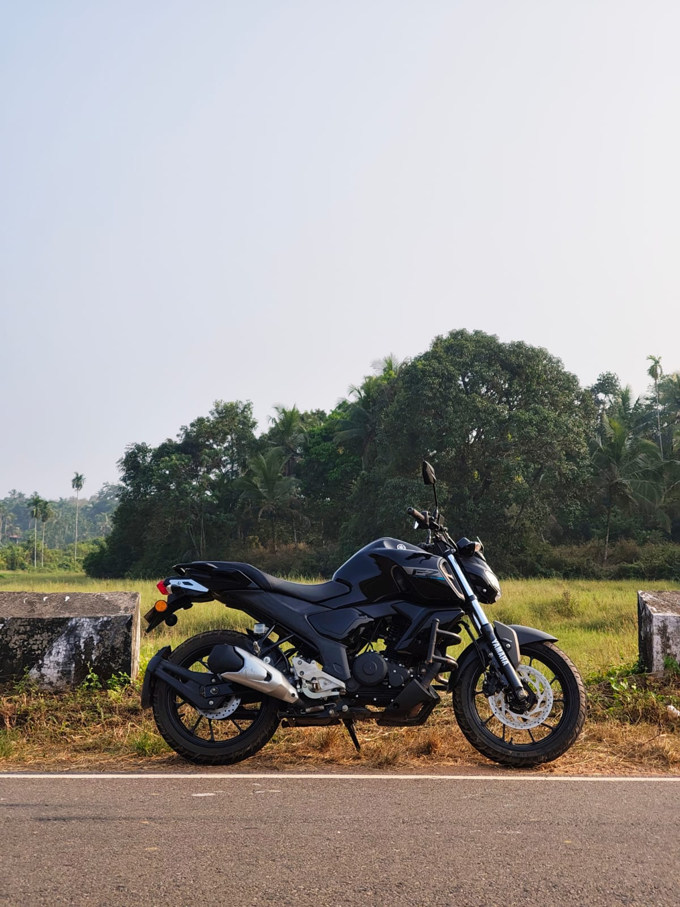
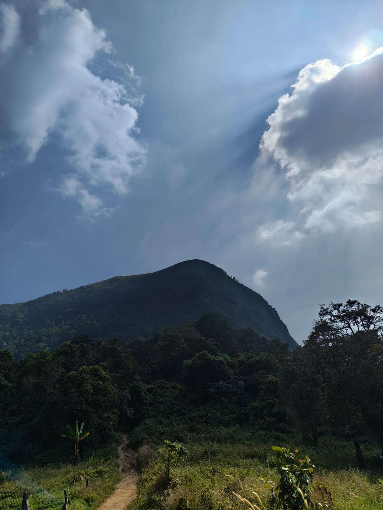
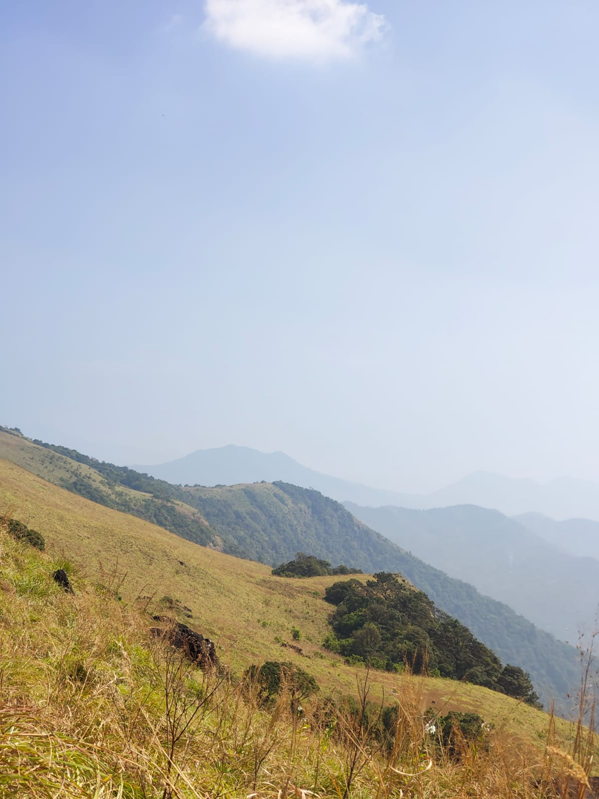
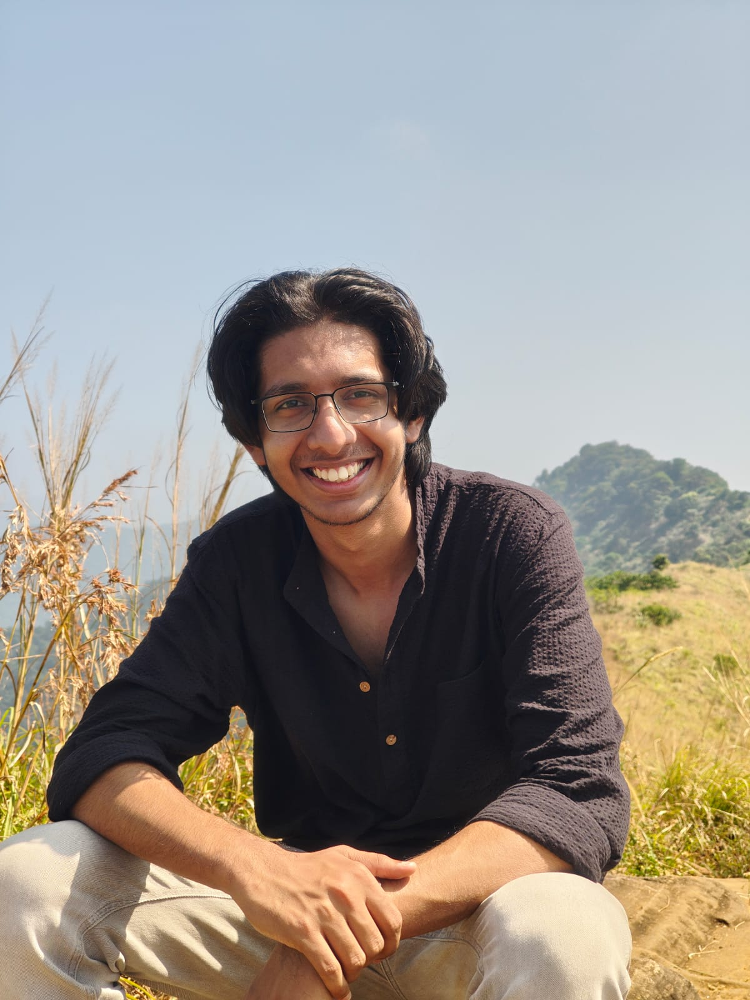

Before I start writing about yesterday's journey I am going to let you all in on an event that happened last year around the first or second week of December. I was watching a lecture on gravitational wave data analysis when a school friend of mine suddenly called, telling me he's back home for his semester break. 5 minutes into the conversation, he said "Let's go to Paithalmala, it'll be a great experience". This happened around 11\:00 AM. The catch to this was that Paithalmala is roughly 50 km from my home and the only way to reach is by a private transportation (ideally a bike). I didn't have much experience riding a bike apart from main highways, also only ever riding for short distances at a stretch. I somehow convinced my parents to go to Paithalmala in my bike. To this day, I still consider that day to be the day I actually became a decent bike driver. So yeah I ride that 50 km and we reach around 3\:10 PM. The entry closes at 3\:00 PM. The plan was ruined, or so we thought. Near to Paithalmala there's another place called Kaapimala which has a good waterfall, so the plan was modified to Kaapimala and dinner from a good place. That day became one to remember for a long time, although we never really went to Paithalmala.

Okay now let's talk about yesterday. This time, we learned our lesson and we left early, really early. I left home at around 8\:15 AM and reached our rendezvous point by 9\:00 AM. My friend, who had told me he'd be there by 9, was just leaving his home :/ I'm used to this by now and I just park my bike near a bus stop and stood there. I am 50% sure some would have thought of me to be some kind of a creep. After about 20mins my friends come. These are people that I once used to see everyday for 8-9 hours and now we meet once in a year for around 6-7 hours, but still the connection feels the same and I guess that's the beauty of school friendships. But it's still a bit weird though, all of us go through a lot of change after school and there are things about me that they don't know, parts of me that aren't the same anymore but we still find joy in having a few laughs. Makes me wonder if there is anyone who knows the real you other than just you. I mean yeah your partner might know you to a good amount but when you really think about it, no one other than you know about all the versions of you. 

So we continued the journey, I was talking to myself as if I was making a vlog. It was a combination of [Anurag](https://www.youtube.com/@AnuragSalgaonkar) and [Niko](https://www.youtube.com/@nikoyaps). I was yapping on and on about some topic that I don't even remember but I truly enjoyed it. The roads were amazing, it was smooth that I had lots of fun cornering in a lot of places and the traffic volume wasn't a lot enabling me to continue my yaps. By around 11\:00 AM we reached the bottom of the peak where I parked my bike and we started the climb. 

We were dumb, we didn't bring any kind of food to eat or water to drink. We were like "Oh yeah we're gonna go to Paithalmala" but none of us really thought about the fact that the climb is a steep one and that we'll be tired for sure. I am so very grateful to Kerala Forest Department for providing water at the bottom. 3 of us survived the climb on 1L of water. 

So yes we began the climb, initially we had to go through a bit of a foresty portion, where sunlight was fighting with the vines to reach us, and that was really a sight to see. I am someone who loves to take all the views in before continuing the journey ahead but my friend's were rushing and I didn't have much option but to make do with what I had already seen. I think after a bit of climbing all of us realized that this is gonna be one hard climb, the steepness was something none of us expected. We were walking for 5 minutes, resting for 2.5 and then walking again only to repeat the cycle with lesser time climbing and more time resting. But as the climb proceeded and the mighty Western Ghats started to appear, I couldn't help but stop myself and look at the mesmerizing view. Due to poor visibility conditions, I couldn't take a really good picture but here ya go :)

We finally reached the top of Paithalmala, after about an hour and half of climb. The view was heavenly, and I kind of felt at peace. But we wanted to see more, so after clicking a few pictures of each other and the landscape we continued to explore the mountain top (partially motivated by a guide telling us there's water about 1.5km ahead). So we started walking, and walking and walking with no end in sight. We stopped every now and then to take some pictures but the sun was our enemy. The shadows were too bad to take really good portraits of people. One of my friends really wanted to find that water source but alas it was high time we start the descend because all 3 of us were starting to get dehydrated and wanted to eat food as well. I'll share a few of the pics I took here

So we started the descent and I was cursing myself for wearing a casual shoe for a trek. My legs were starting to shiver, not able to support my body. This reminded me of the last time something like this happened which was back when I was playing football matches. I used to tire myself out so bad that my legs would start shaking because it didn't have enough strength to handle my own body. The descent was quick, surprisingly quick. Quick isn't what I wanted though, I would've loved a smoother descent over a quick one. During the entirety of the descent I just had one thought in my mind "How am I supposed to ride that bike with a weak leg through this rough terrain". To my surprise, I was good at it, there were no problems driving and I got very proud at that. 

We started coming back home and stopped to have some chicken biriyani, honestly I was in the mood to have some good mandhi but couldn't find any place nearby. That was it, this is my first travelogue so there is still room for improvement which shall be made in the future

And last but not least, a pic of me :)

